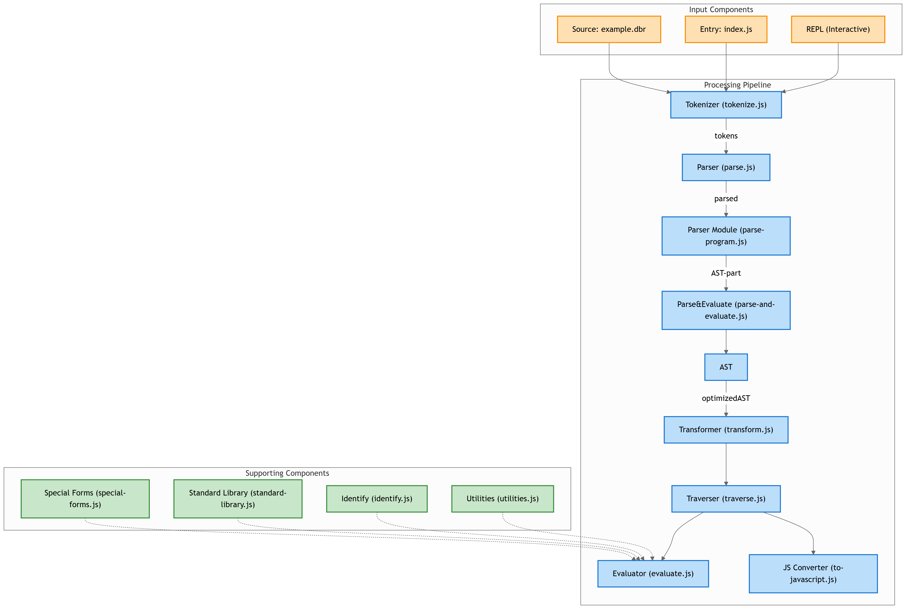

# jsdropbear
jsdropbear is a simple and basic custom programming language interpreter built in JavaScript. It supports basic arithmetic operations, variable declarations, and a REPL (Read-Eval-Print Loop) for interactive programming. The interpreter evaluates expressions written in Dropbear's syntax and outputs the result.

---



---

## Table of Contents
1. [Video Tutorials](#video-tutorials)
2. [Slides & Readings](#slides--readings)
   - [Introduction to Compiler Design](#introduction-to-compiler-design)
   - [Syntax Analysis](#syntax-analysis)
   - [Top-Down Parsers](#top-down-parsers)
3. [Full Course on Programming Languages](#full-course-on-programming-languages)

---

## Video Tutorials
You can explore video tutorials on Compiler Design and Programming Languages here:

- [Compiler Design Playlist (Neso Academy - YouTube)](https://youtube.com/playlist?list=PLBlnK6fEyqRjT3oJxFXRgjPNzeS-LFY-q)
  
  This YouTube playlist covers various aspects of Compiler Design and programming language theory.

---

## Slides & Readings

### Introduction to Compiler Design
- [Introduction to Compiler Design (Neso Academy)](https://www.nesoacademy.org/cs/12-compiler-design/ppts/01-introduction-to-compiler-design)

  This presentation provides a comprehensive introduction to the topic of Compiler Design, its phases, and important concepts.

### Syntax Analysis
- [Syntax Analysis (Neso Academy)](https://www.nesoacademy.org/cs/12-compiler-design/ppts/02-syntax-analysis)

  Learn about the process of syntax analysis, which checks whether a sequence of tokens matches the syntax rules of a programming language.

### Top-Down Parsers
- [Top-Down Parsers (Neso Academy)](https://www.nesoacademy.org/cs/12-compiler-design/ppts/03-top-down-parsers)

  This presentation delves into top-down parsing techniques, including recursive descent parsing and LL parsers.

---

## Full Course on Programming Languages
- [Programming Language Fundamentals (Frontend Masters)](https://frontendmasters.com/courses/programming-language/)

  This is a complete course on the fundamentals of programming languages, exploring language design, compilers, interpreters, and more.

---


## 🚀 Features
- Custom **REPL (Read-Eval-Print Loop)** for interactive JavaScript execution.
- **Lexical Analysis** to tokenize the input source code.
- **Parsing** using a **Recursive Descent Parser** via Babel’s `@babel/parser`.
- **AST (Abstract Syntax Tree) Generation** using Babel’s powerful tooling.
- **Code Evaluation** with custom interpreters.
- **Error Handling** for syntax and runtime errors.
- Interactive CLI using **Inquirer** for enhanced user experience.

---

## How to Run:

1. Install dependencies

```bash
npm install
```

2. Running a Program

```bash
node bin/dropbear run examples/example.dbr
```

3. Using the REPL
```bash
node src/repl.js (or) node bin/dropbear
```

4. Install jest to run the Test-cases
```bash
npm install --save-dev jest
```

5. To run the Test-cases

```bash
npm test (or) npx jest (or) ./node_modules/.bin/jest
```
---

## Project Structure

```bash
+-- bin/
¦   +-- dropbear            # Main executable for running programs or starting REPL
+-- examples/
¦   +-- example.dbr         # Example Dropbear program
+-- src/
¦   +-- evaluate.js         # Evaluator for interpreting AST
¦   +-- identify.js         # Token identification logic
¦   +-- index.js            # Central module to export core functions
¦   +-- parse-and-evaluate.js # Chain of functions for tokenization, parsing, and evaluation
¦   +-- parse-program.js    # Program parsing logic
¦   +-- parse.js            # Token parsing into AST
¦   +-- repl.js             # REPL implementation
¦   +-- special-forms.js    # Special forms like define
¦   +-- standard-library.js # Standard library (e.g., math functions)
¦   +-- to-javascript.js    # Convert AST to JavaScript code
¦   +-- tokenize.js         # Tokenizer for input
¦   +-- transform.js        # AST transformation (e.g., handling define)
¦   +-- traverse.js         # AST traversal utilities
+-- tests/
¦   +-- evaluate.test.js    # Unit tests for evaluate.js
¦   +-- parse-program.test.js # Unit tests for parse-program.js
¦   +-- parse.test.js       # Unit tests for parse.js
¦   +-- special-forms.test.js # Unit tests for special-forms.js
¦   +-- to-javascript.test.js # Unit tests for to-javascript.js
¦   +-- tokenize.test.js    # Unit tests for tokenize.js
¦   +-- transform.test.js   # Unit tests for transform.js
¦   +-- traverse.test.js    # Unit tests for traverse.js
+-- .babelrc                # Babel configuration for transpiling JavaScript
+-- .gitignore              # Git ignore rules
+-- .prettierrc             # Prettier configuration for code formatting
+-- package-lock.json       # Lock file for dependencies
+-- package.json            # Project metadata and dependencies
```

---

